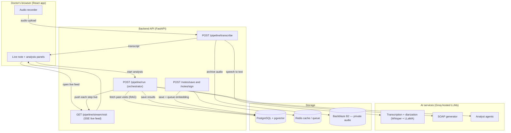
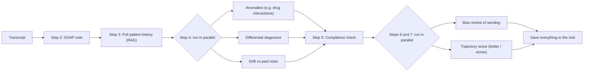
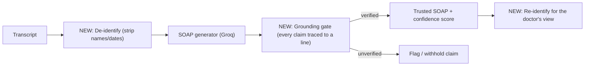
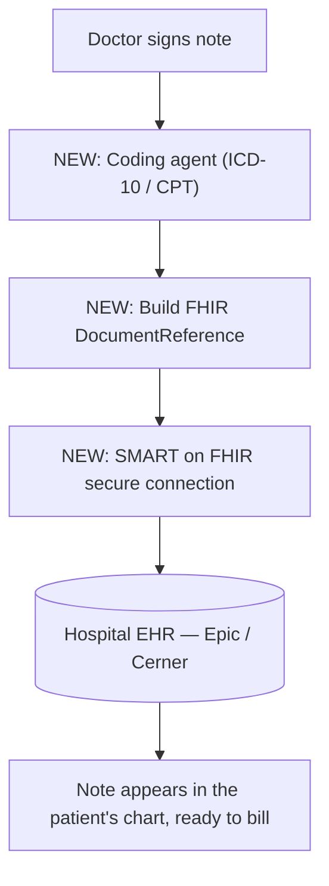
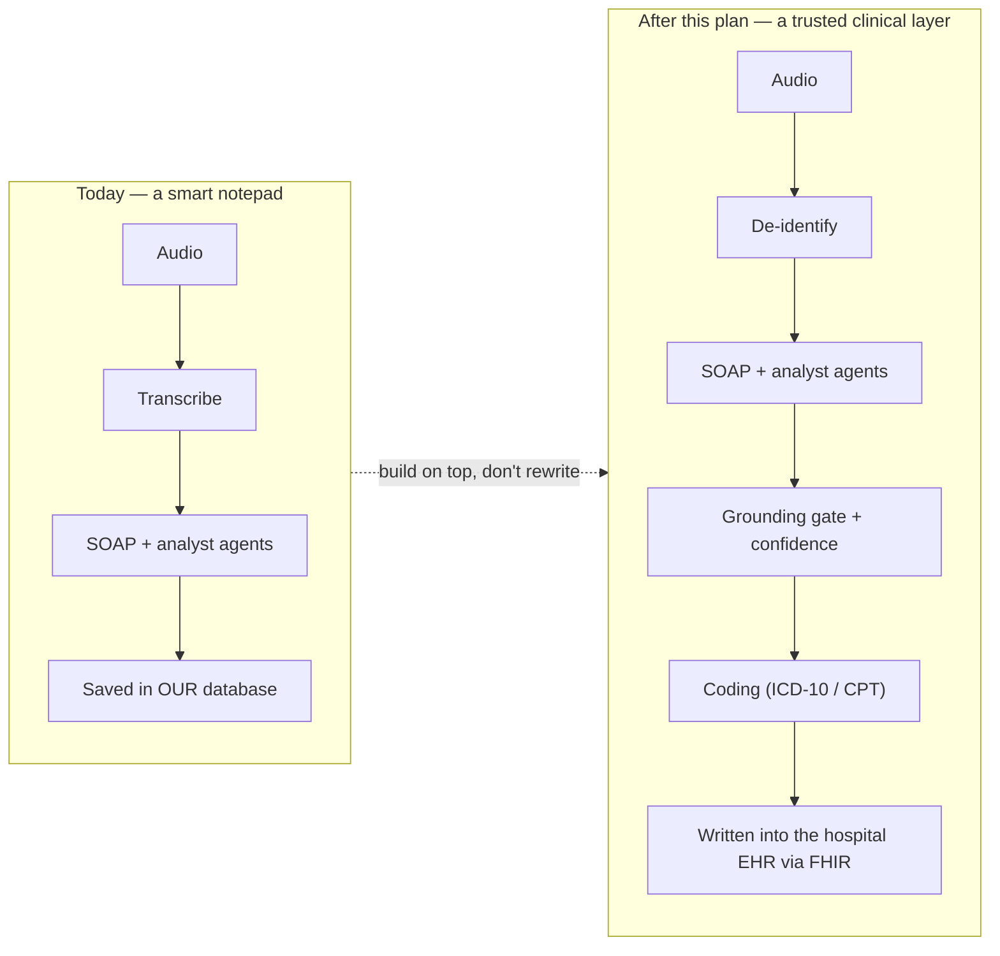

# MediScribe — Build Plan

*How the product works today, what we're missing versus the market, and exactly what we're going to build on top of it — written so anyone can follow, with every bit of jargon explained.*

Last updated: 2026-06-12 · Companion to the competitive analysis canvas.

---

## 1. The whole plan in one paragraph (plain English)

MediScribe listens to a doctor–patient conversation, turns it into a clean medical note, and — unlike most rivals — *remembers the patient across visits* so it can spot trends (getting better, getting worse), contradictions, and bias in the wording. That "memory" is our edge. But to actually get used in a real clinic, we're missing three boring-but-critical things: (1) proof that the AI didn't make anything up, (2) the ability to push the finished note **into the hospital's existing records system**, and (3) automatic billing codes. The plan: first make the AI *trustworthy*, then make it *connect* to hospital systems, then make it *scale* (more languages, more note types, certifications). Do those in order and we own a spot no competitor fully holds: **verified, memory-aware notes written straight into the patient's chart.**

---

## 2. Jargon decoder

Read this once and the rest of the document is easy.

| Term | Plain-English meaning |
|---|---|
| **SOAP note** | The standard 4-part medical note: **S**ubjective (what the patient says), **O**bjective (exam findings/vitals), **A**ssessment (the diagnosis), **P**lan (what to do next). |
| **Ambient scribe** | An AI that quietly listens to the visit and writes the note for the doctor. "Ambient" = it works in the background; the doctor doesn't dictate to it. |
| **Pipeline** | The assembly line of steps a recording goes through: transcribe → write note → analyze → save. |
| **Transcription / ASR** | Turning spoken audio into text. ASR = "Automatic Speech Recognition." |
| **Diarization** | Figuring out *who said what* — labeling each line as "doctor" or "patient." |
| **LLM** | "Large Language Model" — the AI brain (like the model behind ChatGPT) that writes and reasons over text. We use models hosted by **Groq**. |
| **RAG** | "Retrieval-Augmented Generation." Before the AI writes, we fetch the patient's relevant past notes and hand them to it, so it answers using real history instead of guessing. |
| **Embeddings / pgvector** | A way to store text as numbers so the computer can find "similar" past visits quickly. `pgvector` is the database add-on that does this search. |
| **SSE** | "Server-Sent Events." A one-way live feed from server to browser, so the doctor sees each step pop up in real time instead of waiting for everything. |
| **EHR** | "Electronic Health Record" — the hospital's official patient records software (e.g., **Epic**, **Oracle/Cerner**). This is where doctors actually live all day. |
| **FHIR** | The standard "language" hospitals use to exchange health data. To put our note into Epic, we speak FHIR. |
| **SMART on FHIR** | A standard way for an outside app to securely launch *inside* the EHR and read/write data. |
| **DocumentReference** | The specific FHIR "envelope" you wrap a clinical note in to file it into the chart. |
| **ICD-10 / CPT / E&M codes** | Billing/diagnosis codes. ICD-10 = the diagnosis, CPT/E&M = the service performed. Clinics need these to get paid. |
| **PHI** | "Protected Health Information" — anything that identifies a patient (name, DOB, address). Legally must be guarded carefully. |
| **De-identification (de-id)** | Stripping out PHI (names, dates, etc.) *before* sending text to an AI, so identifiers never leave our walls unnecessarily. |
| **Grounding / hallucination gate** | A check that every sentence in the note can be traced back to something actually said in the conversation. "Hallucination" = the AI making up facts. |
| **HIPAA** | The US health-privacy law. Sets the rules for handling PHI. |
| **BAA** | "Business Associate Agreement" — the contract a vendor (e.g., Groq) signs promising to handle PHI legally. |
| **SOC 2 / HITRUST** | Security certifications hospitals demand before they'll buy from you. |
| **Graceful degradation** | If one AI step fails, the rest of the system keeps working and tells you which part is incomplete — instead of crashing. |

---

## 3. What we have today

### 3.1 The journey of a single visit (plain English)

1. The doctor hits **record** in the browser during the visit.
2. The audio is sent up; we **transcribe** it and label who's speaking. The audio file itself is locked away in private storage.
3. The browser opens a **live feed (SSE)** so the doctor watches results appear step by step.
4. Our **pipeline** runs: it writes the SOAP note, pulls up the patient's history, then runs a panel of "analyst" AIs (anomalies, possible diagnoses, mood/symptom drift, compliance, bias, and a long-term trajectory score).
5. Everything is **saved** to the patient's visit record. The doctor edits and **signs** the note, which locks it.

### 3.2 The current architecture (diagram)



### 3.3 Inside the pipeline — the 6-agent assembly line

This is the part competitors mostly don't have. Each step streams its result to the doctor the instant it's ready.



**Why this is resilient:** every step uses a "safe call" wrapper. If, say, the bias check fails, the pipeline records `bias_review` as **degraded**, keeps going, and finishes the rest of the note. Nothing crashes the whole run. (This is *graceful degradation*.)

### 3.4 Tech stack (what it's built with)

| Layer | Tool | In plain English |
|---|---|---|
| Backend | FastAPI (Python, async) | The server that handles requests |
| Database | PostgreSQL 15 + pgvector | Stores data + enables "find similar past visits" |
| AI | Groq-hosted Whisper + LLaMA | Speech-to-text and the writing/reasoning brain |
| Cache/queue | Redis + Celery | Speed-ups and background jobs |
| Storage | Backblaze B2 (private) | Where audio files are locked away |
| Live updates | Server-Sent Events | The real-time feed to the browser |
| Frontend | React (Vite) | The doctor's web app |
| Security (just added) | Cookie auth, CSRF, rate limiting, PHI audit log | Hardened login + abuse protection |

### 3.5 What already makes us special

- **Cross-visit memory** (trajectory + drift + anomalies vs history). Most rivals forget the patient between visits.
- **A panel of analyst agents** (not just a note writer).
- **Evidence links** — the SOAP note already records which transcript lines each section came from (`source_lines`). This is the foundation for the "grounding gate" below.
- **A resilient pipeline** that degrades gracefully and logs PHI access.

---

## 4. What we're missing (and why it matters)

Researched against the 2026 leaders (Nuance DAX Copilot, Abridge, Suki, Nabla, DeepScribe, Ambience, Glass Health).

| Gap | What it means in plain English | Why it's critical |
|---|---|---|
| **EHR write-back** | We can't yet drop the finished note into Epic/Cerner. The doctor would have to copy-paste. | This is the #1 reason scribes get adopted or abandoned. No write-back = no real clinic use. |
| **De-identification before AI** | We send the raw transcript (with names) to Groq. | The single most-cited HIPAA-AI best practice. Strip identifiers before they leave our walls. |
| **Grounding gate** | No automatic check that the note matches what was actually said. | Patient safety + trust. A made-up symptom in a chart is dangerous. We already have the raw material (`source_lines`). |
| **Automatic coding** | We don't suggest ICD-10/CPT billing codes. | Table stakes in 2026 and the direct way clinics make/save money. |
| **Live transcription view** | Transcription happens in one batch, not word-by-word live. | Doctors expect to watch the note form in real time. |
| **Multiple note types** | We only produce SOAP. | Rivals ship 6+ (H&P, progress note, discharge summary, etc.). |
| **Accuracy benchmark** | No measured/published accuracy numbers. | Buyers ask "how accurate, how often does it hallucinate?" We need an answer. |
| **Multilingual** | English-focused. | Competitors advertise 28–80+ languages. |
| **Certifications** | No SOC 2 / HITRUST yet. | A hard gate for hospital procurement. |

---

## 5. What we're going to build over it

Three phases. **Do them in order** — each unlocks the value of the next.

### Phase 1 — Make the AI trustworthy *(build on top, no rewrites)*

Goal: a doctor (and a hospital's lawyers) can trust the output. These are mostly backend additions that reuse what we already have.

1. **Grounding gate** — after the SOAP note is written, verify each sentence traces back to a transcript line (we already store `source_lines`). Anything unverified gets flagged or held back, and we attach a confidence score.
2. **De-identification layer** — strip patient identifiers from the transcript *before* it goes to Groq, then map them back afterward.
3. **Evaluation harness** — a repeatable test that measures note accuracy and hallucination rate so we can publish real numbers.
4. **Degraded banner (frontend)** — the backend already reports `degraded_steps`; show the doctor a clear "this note is partial" banner when it happens.



### Phase 2 — Get into the clinic *(the adoption unlock)*

Goal: the note lands in the hospital's real system, with billing codes, in the format they need.

1. **EHR write-back** — speak **FHIR**: wrap the signed note in a **DocumentReference** and file it into the encounter via **SMART on FHIR**. Start with one EHR (Epic sandbox).
2. **Coding agent** — a new pipeline step that suggests **ICD-10 / CPT / E&M** codes from the note.
3. **Multiple note types** — templates beyond SOAP (H&P, progress, discharge).
4. **Live transcription view** — stream text word-by-word as the visit happens.



### Phase 3 — Scale and sell to big hospitals

1. **Multilingual** transcription + notes.
2. **Multi-model orchestration** — don't depend on a single AI provider; fall back automatically.
3. **Specialty packs** — tuned templates per specialty.
4. **SOC 2 Type II / HITRUST** + patient consent capture — the procurement gate.

---

## 6. Before vs after (the big picture)



The core pipeline (our moat) stays exactly as-is. We're **wrapping** it with a trust layer (front) and a delivery layer (back).

---

## 7. Roadmap at a glance

| Phase | Item | Effort | Depends on |
|---|---|---|---|
| 1 | Grounding gate | Medium | reuses `source_lines` |
| 1 | De-identification before Groq | Medium | — |
| 1 | Evaluation harness | Medium | — |
| 1 | Degraded banner (frontend) | Low | backend already emits `degraded_steps` |
| 2 | FHIR DocumentReference write-back | High | Epic sandbox access |
| 2 | Coding agent (ICD-10 / CPT / E&M) | Medium | grounding gate (Phase 1) |
| 2 | Multiple note types | Medium | — |
| 2 | Live transcription view | Medium | streaming ASR |
| 3 | Multilingual | Medium | — |
| 3 | Multi-model orchestration + fallback | Low–Med | — |
| 3 | SOC 2 / HITRUST + consent | Operational | — |

---

## 8. How we'll know it worked

- **Phase 1:** we can state a measured accuracy and hallucination rate, and no unverified claim reaches a signed note.
- **Phase 2:** a doctor finishes a visit and the coded note appears in the EHR **without copy-paste**.
- **Phase 3:** the product passes a hospital security review and works in more than one language.

**The one-line pitch we're building toward:** *verified, memory-aware clinical notes written straight into the patient's chart* — a combination none of the current leaders fully own.

---

## 9. Suggested first step

The highest-leverage, self-contained starting point is the **grounding gate** — it's pure backend, builds directly on the `source_lines` we already capture, and is what makes everything else (especially coding) trustworthy. A close second is the **de-identification layer** (a contained privacy win). Either can be specced and implemented without touching the existing pipeline's core logic.
```
