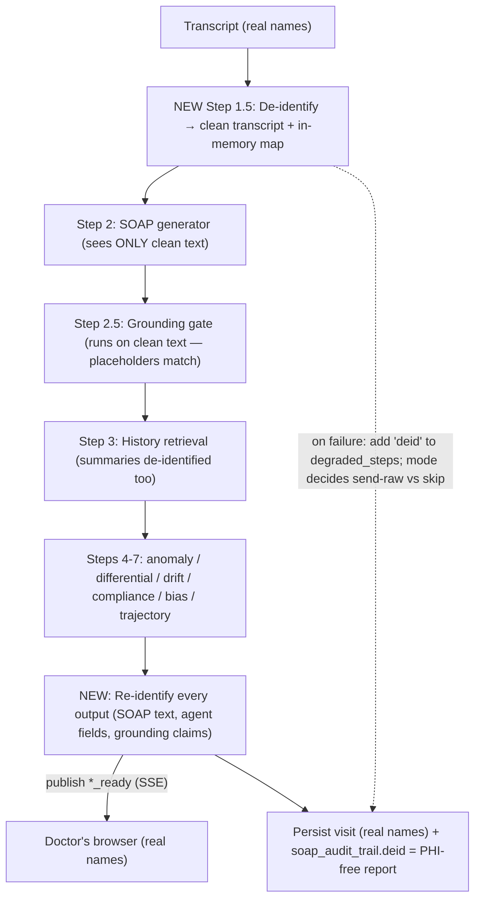
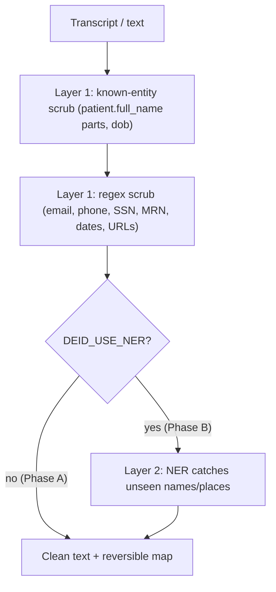

# De-identification Layer — Technical Spec

*The second "trust" feature from `BUILD_PLAN.md` (Phase 1 §5.2). This spec defines exactly what we'll build, how it slots into the existing pipeline, the data shapes, config, UX, rollout, and tests — in plain English with jargon explained.*

Last updated: 2026-06-12 · Companion to `BUILD_PLAN.md`, `GROUNDING_GATE_SPEC.md`, and `SUCCESS_STATES.md`.

---

## 1. One paragraph (plain English)

Right now, when we ask the AI to write the note and run the analyst agents, we hand it the **raw transcript** — which contains the patient's name, dates, and anything else that was said out loud. The **de-identification layer** strips those identifiers out *before* the text goes to the AI, swapping each one for a neutral placeholder like `[PATIENT]` or `[DATE_1]`, and keeps a private, in-memory "key" so we can put the real values **back** in the version the doctor sees. The AI does all its reasoning on de-identified text; the doctor sees a normal, fully-named note. The real identifiers never need to sit in an AI prompt, a prompt log, or a cache. This is the single most-cited HIPAA-AI best practice and it's a contained change: a wrapper around the transcript, not a rewrite of the pipeline.

---

## 2. Jargon decoder

| Term | Plain meaning |
|---|---|
| **PHI** | "Protected Health Information" — anything that can identify a patient (name, DOB, phone, address, MRN…). HIPAA legally protects it. |
| **The 18 HIPAA identifiers** | The official list of things that count as PHI (names, dates, phone, email, SSN, record numbers, etc.). De-id targets these. |
| **De-identification (de-id)** | Removing/replacing identifiers in text so it no longer points to a specific person. |
| **Re-identification (re-id)** | Putting the real identifiers back, using the saved key, for the doctor's view. |
| **Pseudonymization** | Replacing an identifier with a consistent placeholder (`[PATIENT]`) rather than just deleting it — so the text still reads naturally and the AI keeps the references straight. |
| **Reversible map / key** | The private lookup `{ "[PATIENT]": "Jane Doe", "[DATE_1]": "March 3" }`. It **is** PHI, so it lives in memory for the request only and is **never** persisted in plaintext. |
| **Rules-based de-id** | Deterministic find-and-replace using what we already know (the patient's name from their record) plus regex for universal patterns (emails, phones, SSNs, dates). Fast, free, no AI. |
| **NER** | "Named-Entity Recognition" — a model that finds names/places/dates it wasn't told about (e.g., a spouse's name said mid-visit). The Phase-B upgrade. |
| **ASR** | "Automatic Speech Recognition" — turning audio into text (Groq Whisper). Relevant because the *audio itself* still contains spoken PHI (see scope below). |
| **Fail-closed / fail-open** | If de-id fails, **fail-closed** = don't send the text to the AI at all; **fail-open** = send the raw text anyway. A privacy/availability trade-off. |
| **`_maybe_call` / `degraded_steps`** | The existing graceful-degradation helpers (see `BUILD_PLAN.md` §3.3). De-id will participate. |

---

## 3. What exists today vs. the gap

**Already in place** (verified in code):
- The transcript reaches the LLM as plain text via `_format_transcript_for_prompt(...)` → `chat_completion(...)` in `backend/services/soap_generator.py` (lines 40–48, 88–99). Spoken names land directly in the prompt.
- The SOAP note text then flows to the analyst agents (`anomaly_agent`, `differential_agent`, `compliance`, `bias_review`, …), and `history_retrieval` injects **past visit summaries** (also PHI) into the agents.
- We hold a structured patient record with the exact identifiers to scrub: `Patient.full_name`, `dob`, `gender` (`backend/schemas/patient.py`, `backend/models/patient.py`).
- `visit.soap_audit_trail` (JSONB) already stores `{"grounding": …}` — we can add `{"deid": …}` (a **PHI-free** report) alongside it. No migration.
- `_run_pipeline` + `_maybe_call` + `degraded_steps` + SSE bus are the integration points (`backend/api/routes/pipeline.py`).

**The gap:** raw PHI is sent to the LLM on every SOAP-generation and agent call, and can appear in prompt logs, Redis caches, and any future non-BAA model usage. Nothing strips it; nothing tracks what was exposed.

---

## 4. Scope — be honest about what this does and doesn't cover

**In scope (Phase A): the *text* sent to the reasoning LLMs.**
- The transcript before SOAP generation, the SOAP text before the agents, and injected history summaries.
- This removes PHI from: LLM prompts, prompt/debug logs, and Redis-cached intermediate text — and unlocks using a cheaper/non-BAA model for the *reasoning* steps later.

**Explicitly out of scope (documented, not silently ignored):**
- **ASR audio.** Transcription is audio→text via Groq Whisper; you cannot de-identify audio before it's transcribed. Spoken names still reach the ASR model. That exposure stays governed by our **BAA with Groq** and the private-audio storage we already have. De-id is **defense-in-depth on top of the BAA**, not a replacement for it.
- **The stored transcript.** `raw_transcript` keeps the true text for the doctor; it is never replaced with placeholders. (Its protection is auth + DB security, already in place.)
- **Structured PHI columns** (patient name/DOB rows). Those are intentional records, not free-text leakage.

> **Why it's still worth it even though ASR sees the audio:** the biggest, easiest leaks are in *text* prompts, logs, and caches that fan out across many calls and providers. Minimizing PHI there is high-value, low-risk, and is the explicit best practice buyers ask about.

---

## 5. Where it slots into the pipeline

De-id runs **once**, right after we have the transcript and before any LLM call. The whole LLM portion then operates on de-identified text. Every artifact the LLM produces is **re-identified** at the boundary — just before it's streamed to the browser and before it's persisted.



Two copies exist during the run: the **clean** copy (for all processing) and the **re-identified** copy (for display + persistence). Re-id is applied at each SSE publish point and once before the final persist.

Pseudo-wiring inside `_run_pipeline`:

```python
# right after we have `payload.transcript`, before SOAP generation
deid_fn = _resolve("services.deid", "deidentify_transcript")
deid = await _maybe_call(deid_fn, payload.transcript, patient, default=None,
                         label="deid", degraded=degraded_steps)
clean_transcript = deid.transcript if deid else payload.transcript   # fail-open default
deid_map = deid.map if deid else {}

# ...run SOAP + grounding + agents on clean_transcript / clean soap...

# at each publish + final persist:
await bus.publish(vid, EVENT_SOAP_READY, reidentify(soap_note.model_dump(mode="json"), deid_map))
```

---

## 6. How de-id works (two layers, mirrors the grounding gate)



### Layer 1 — Rules (deterministic, ships first, no LLM, no heavy deps)
1. **Known entities first** — we already have the truth: replace `patient.full_name` (and its individual name tokens, case-insensitive, word-boundary) with `[PATIENT]`; the patient's `dob` with `[DOB]`. This is the highest-precision pass because it uses real record data, not guesses.
2. **Regex for universal identifiers** — email, phone (intl/US formats), SSN, long digit runs / MRN-like IDs, URLs, and dates (numeric + "March 3, 2026" style). Each match type gets a stable placeholder family: `[EMAIL_1]`, `[PHONE_1]`, `[DATE_1]`, `[ID_1]`, …
3. **Consistent numbering** — the same original value always maps to the same placeholder within a run (so the AI keeps references straight, and re-id is unambiguous).
4. **Build the reversible map** `{placeholder: original}` in memory only.

### Layer 2 — NER (opt-in via flag, Phase B)
When `DEID_USE_NER=true`, run a NER pass (recommend **Microsoft Presidio** on **spaCy**) to catch identifiers Layer 1 can't know about — a spouse's first name, an employer, a city. NER can only **add** redactions, never un-redact. Off by default so Phase A has zero new dependencies and zero added latency.

> **Why rules-first:** the patient's own name + the regex patterns cover the overwhelming majority of real leakage, deterministically and for free. NER is a recall upgrade we enable once the contained v1 is proven.

### Re-identification (both phases)
`reidentify(obj, map)` deep-walks any string in a dict/list and replaces placeholder substrings with their originals.
- **Failure mode is safe by construction:** if the LLM mangled or dropped a placeholder, re-id simply leaves a harmless `[DATE_1]` in the text — it can **never** leak PHI, because the only thing it ever writes back is what we removed. The worst case is a cosmetic leftover placeholder, which we can also flag.

---

## 7. Data shapes (new Pydantic, `backend/schemas/pipeline.py`)

The persisted artifact is a **PHI-free report** — never the map.

```python
DeidCategory = Literal["name", "dob", "date", "phone", "email", "id", "url", "address", "other"]

class DeidReport(BaseModel):
    applied: bool                       # did de-id actually run this pass?
    method: Literal["rules", "rules+ner"] = "rules"
    entity_count: int = 0               # how many spans were replaced
    by_category: dict[str, int] = Field(default_factory=dict)
    residual_placeholders: int = 0      # leftover placeholders after re-id (should be 0)
```

The reversible map is **not** a schema and **not** persisted. In code it's a plain `dict[str, str]` that lives only for the duration of the request.

Add to the existing `PipelinePayload`:

```python
    deid: DeidReport | None = None
```

---

## 8. Config & modes (`backend/core/config.py`)

| Setting | Default | Meaning |
|---|---|---|
| `DEID_MODE` | `on` | `off` = skip entirely (send raw) · `on` = de-identify, fail-open if it errors · `enforce` = de-identify, **fail-closed** (skip the LLM step + mark degraded rather than send raw) |
| `DEID_USE_NER` | `false` | Enable the Layer-2 NER pass (Phase B; pulls Presidio + spaCy) |
| `DEID_NER_MODEL` | `en_core_web_lg` | spaCy model for NER when enabled |
| `DEID_REDACT_DATES` | `true` | Dates are HIPAA identifiers, but blanket date redaction can hurt clinical reasoning ("3 days ago"). Toggle to scope it. |
| `DEID_FLAG_RESIDUAL` | `true` | If any placeholder survives re-id, record it in `residual_placeholders` (and `degraded_steps` in `enforce`) |

**Recommended rollout:** ship Phase A with `DEID_MODE=on` (active, fail-open) so we get the privacy win immediately without risking availability; promote to `enforce` once we've watched `residual`/error rates in real runs. `off` stays available for local debugging.

---

## 9. Persistence & transport

- **Persist:** merge into the existing column — `visit.soap_audit_trail["deid"] = deid_report.model_dump(mode="json")` (sits next to `["grounding"]`). **No DB migration.** The map is discarded at end of request.
- **Stored note + transcript are the real ones** (re-identified). Only the *report* is stored under `deid`.
- **SSE:** no new event needed — de-id is invisible to the client; it just means every existing `*_ready` payload is re-identified before it's published. (Optionally add a tiny `deid_ready` for the UI badge in §10; recommended **no** for Phase A.)
- **Read-back:** include `deid` in the `/pipeline/run` response and `/pipeline/run-status/{visit_id}` (read the report from `soap_audit_trail`).

---

## 10. Frontend UX (small)

De-id is mostly invisible by design — the doctor sees real names. The only surface:
- **A subtle reassurance badge** near the note: "PHI removed before AI" with a tooltip showing the count (e.g., "7 identifiers protected · names, dates"). Reads from `payload.deid`.
- **Degraded:** if `deid` is in `degraded_steps` (only possible in `enforce`), the existing "Partial note" banner names it; the badge reads "PHI scrub incomplete."

No new heavy components; this rides on the SOAP header and the banner system we already have. (Recommended to keep Phase A backend-only and add the badge in a fast follow.)

---

## 11. New/changed files (implementation surface)

| File | Change |
|---|---|
| `backend/services/deid.py` | **New.** `deidentify_transcript(transcript, patient) -> DeidOutcome` (clean transcript + map + report); `deidentify_text(text, map) -> str`; `reidentify(obj, map) -> obj`; Layer-2 NER behind the flag. |
| `backend/schemas/pipeline.py` | Add `DeidReport` + `PipelinePayload.deid`. |
| `backend/core/config.py` | Add the `DEID_*` settings. |
| `backend/api/routes/pipeline.py` | De-id transcript before SOAP; thread clean text through SOAP/grounding/agents/history; re-identify every SSE payload + the final persisted payload; persist the PHI-free report; honor `enforce` fail-closed. |
| `backend/services/history_retrieval.py` | De-identify injected past-visit summaries before they reach the agents (uses the same map where possible, else its own pass). |
| `backend/.env.example` | Document the new settings. |
| `frontend/src/components/SOAPNote/SOAPNote.jsx` (+ css) | *(optional, fast-follow)* "PHI removed before AI" badge from `payload.deid`. |
| `backend/tests/test_deid.py` | **New.** Unit + pipeline integration tests. |

---

## 12. Testing plan

**Unit (`test_deid.py`):**
- **Known-entity scrub:** transcript mentioning the patient's name/DOB → those spans become `[PATIENT]` / `[DOB]`; the cleaned text contains neither original.
- **Regex categories:** email, phone, SSN, MRN-like ID, URL, date each get the right placeholder family; `by_category` counts match.
- **Round-trip:** `reidentify(deidentify(x))` restores the original for every replaced span.
- **Consistency:** the same original value maps to the same placeholder across multiple occurrences.
- **Re-id safety:** an LLM output that dropped/garbled a placeholder yields a leftover placeholder, **never** PHI; `residual_placeholders` is counted.
- **Report is PHI-free:** assert no original identifier string appears anywhere in `DeidReport`.
- **NER path (mocked/skipped if model absent):** Layer 2 catches an unseen first name; only adds redactions.

**Integration (extend `test_pipeline_routes.py`):**
- Run `/pipeline/run` with a transcript containing the patient's name; capture what `soap_generator.generate` received and assert the name is **absent** (placeholder present).
- Assert the **persisted** SOAP note + `run-status` payload contain the **real** name (re-id worked) and a `deid` report with `applied=true`.
- `DEID_MODE=enforce` + de-id forced to raise → SOAP step is skipped/degraded, `deid` in `degraded_steps`, and the raw name never reaches the (stubbed) LLM.
- `DEID_MODE=off` → de-id not applied, `deid.applied=false`.

---

## 13. Phased delivery & magnitude

| Phase | Scope | Effort | New deps |
|---|---|---|---|
| **A (ship first)** | Rules de-id (known-entity + regex), reversible map, re-id of all outputs, `on`/`off`/`enforce` modes, schema + report, persistence, history de-id, tests | Medium | **None** |
| **B** | Layer-2 NER (Presidio + spaCy) behind `DEID_USE_NER`; UI "PHI removed" badge | Medium | Presidio, spaCy |
| **C** | Residual-PHI scanner + alerting, configurable date strategy, audit log entry per run; consider de-id of ASR via post-transcription scrub before storage | Small–Med | — |

Phase A is self-contained, adds **no new dependencies**, doesn't touch SOAP-generation or agent logic (only what text they're handed), and is safe to ship with `DEID_MODE=on` (fail-open).

---

## 14. Open decisions (need your call)

1. **Default mode** — ship Phase A as `on` (active, fail-open; recommended) or `off` (opt-in) to start? Fail-open means a de-id error degrades privacy but never blocks a note.
2. **Fail-closed timing** — keep `enforce` for Phase C, or expose it in Phase A so privacy-strict deployments can opt in immediately? (Recommend: expose the setting in A, default `on`.)
3. **Date redaction** — dates are HIPAA identifiers, but relative timing matters clinically. Redact absolute dates only and keep relative phrases ("3 days ago")? (Recommended.)
4. **NER in v1?** — recommend **no** (rules-only first), enable in Phase B. Confirm.
5. **UI badge now or fast-follow?** — recommend backend-only Phase A, add the "PHI removed before AI" badge in Phase B. Confirm.

---

## 15. Bottom line

The de-identification layer keeps the real identifiers out of every AI prompt, log, and cache while the doctor still sees a fully-named note — a reversible swap-and-restore wrapped around the transcript, not a pipeline rewrite. Phase A is deterministic, dependency-free, and uses the patient record we already store, with a re-identification step whose only failure mode is a harmless leftover placeholder. It's the privacy half of the trust story the grounding gate started, and it's a prerequisite buyers and hospital security reviews explicitly look for.
