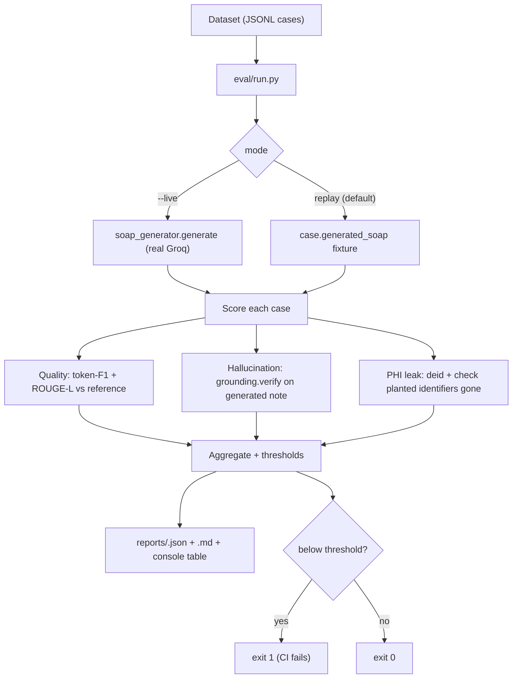

# Evaluation Harness — Technical Spec

*The third "trust" feature from `BUILD_PLAN.md` (Phase 1 §5.3). A repeatable test that measures how good and how safe our notes are — so we can publish real numbers instead of adjectives. Plain English, jargon explained.*

Last updated: 2026-06-12 · Companion to `BUILD_PLAN.md`, `GROUNDING_GATE_SPEC.md`, `DEID_SPEC.md`.

---

## 1. One paragraph (plain English)

Right now if a hospital asks "how accurate is your note, and how often does the AI make things up?", we have no number to give them. The **evaluation harness** is a script we run against a fixed set of example visits with known-good answers. It generates the note, then automatically scores it: how close the note is to the reference (**quality**), how many sentences aren't backed by the transcript (**hallucination rate**), and whether any patient identifier slipped past de-identification (**PHI leak rate**). It prints a scorecard and saves a report. Run it before every release and we can both *publish* trustworthy numbers and *catch regressions* (a change that quietly makes notes worse) before they ship.

---

## 2. Jargon decoder

| Term | Plain meaning |
|---|---|
| **Harness** | A runner that feeds fixed inputs through our code and checks the outputs automatically. |
| **Dataset / case** | One example visit: a transcript plus the "right answers" we score against (reference note, planted identifiers, etc.). |
| **Reference / gold** | The hand-written correct answer we compare the AI's output to. |
| **Quality metric** | A number for "how close is the AI note to the reference." We use token-overlap scores (below). |
| **Token-F1** | Overlap of words between AI text and reference: precision (how much of the AI's text is right) and recall (how much of the reference it covered), combined. 0–1, higher better. |
| **ROUGE-L** | A standard summary-quality score based on the longest common word sequence. 0–1, higher better. |
| **Semantic similarity** | "Do these mean the same thing" even if worded differently — measured by comparing embeddings (we already have `services/embedding.py`). Optional, behind a flag. |
| **Hallucination rate** | Fraction of note sentences the grounding gate marks unsupported. Lower better. |
| **PHI leak rate** | Fraction of planted identifiers that survived de-identification. Must be **0**. |
| **Regression gate** | A pass/fail threshold: the script exits non-zero (fails CI) if a metric drops below the bar. |
| **Replay / mock mode** | Running without calling real Groq, using pre-recorded model outputs, so the harness is deterministic and free in CI. |

---

## 3. What exists today vs. the gap

**Already in place:**
- Deterministic, DB-free building blocks we can call directly: `services/soap_generator.generate`, `services/grounding.verify`, `services/deid.deidentify_transcript` / `reidentify`.
- Realistic sample transcripts + reference SOAP notes already authored in `seed/seed_demo_data.py` (6 visits) — a ready seed for the first dataset.
- `services/embedding.py` (sentence-transformers, already a dependency) for optional semantic scoring.
- `pytest` + fixtures for the unit-test layer.

**The gap:** nothing measures output *quality*, *hallucination rate*, or *PHI leakage*, and there's no scorecard or regression gate. We can't answer "how accurate?" with a number.

---

## 4. Goals & non-goals

**Goals**
1. Score a batch of cases on **quality** (token-F1 + ROUGE-L per SOAP field), **hallucination rate** (via the grounding gate), and **PHI leak rate** (via de-id).
2. Produce a machine report (JSON) **and** a human scorecard (Markdown + console table).
3. Run **deterministically in CI** (replay mode, no Groq) and **live** (`--live`) for real measurement.
4. Act as a **regression gate**: exit non-zero when a metric falls below a configurable threshold.
5. **No new heavy dependencies** — implement the text metrics ourselves; semantic scoring reuses the embedding model behind a flag.

**Non-goals**
- Not a benchmark against competitors (separate effort).
- Not scoring the DB-dependent agents (drift/trajectory/history) in v1 — focus on SOAP + grounding + de-id, the trust-critical path.
- Not a labeling UI — datasets are hand-authored JSONL to start.

---

## 5. How it runs



**Why two modes:** `--live` gives true numbers but needs a Groq key and is non-deterministic; **replay** (the default) scores a *fixed* `generated_soap` stored on each case, so CI runs are reproducible and free. You record fixtures by running `--live --save-fixtures` once and committing the outputs.

---

## 6. Dataset format (`backend/eval/datasets/*.jsonl`)

One JSON object per line:

```json
{
  "id": "htn-followup-01",
  "transcript": [
    {"line_index": 1, "speaker": "doctor", "text": "How have the headaches been?"},
    {"line_index": 2, "speaker": "patient", "text": "Better since the new dose."}
  ],
  "patient": {"full_name": "Jane Doe", "dob": "1985-07-14"},
  "reference_soap": {
    "subjective": "Headaches improved since dose change.",
    "objective": "",
    "assessment": "Hypertension, improving.",
    "plan": "Continue current dose; recheck in 4 weeks."
  },
  "planted_phi": ["Jane Doe", "555-123-4567"],
  "generated_soap": { "...": "optional fixture for replay mode" }
}
```

- `reference_soap` drives quality scoring (field text only).
- `planted_phi` are identifiers known to appear in the transcript; the de-id check asserts none survive.
- `generated_soap` is the recorded model output for replay; absent ⇒ requires `--live`.
- First dataset (`smoke.jsonl`) seeds 5–6 cases lifted from `seed_demo_data.py`.

---

## 7. Metrics (`backend/eval/metrics.py`, dependency-free)

| Metric | How | Range | Direction |
|---|---|---|---|
| **token_f1(pred, ref)** | normalize → tokenize → set-overlap precision/recall/F1 | 0–1 | ↑ |
| **rouge_l(pred, ref)** | longest-common-subsequence F-measure over tokens | 0–1 | ↑ |
| **semantic_sim(pred, ref)** *(opt, `--semantic`)* | cosine of `embed_text` vectors | 0–1 | ↑ |
| **hallucination_rate(soap, transcript)** | `grounding.verify` → unsupported claims ÷ total claims | 0–1 | ↓ |
| **phi_leak_rate(transcript, patient, planted)** | `deid.deidentify_transcript` → planted strings still present ÷ planted | 0–1 | ↓ (must be 0) |
| **residual_placeholders** | `count_residual` after a round-trip | int | =0 |
| **latency_ms** *(live only)* | wall-clock per stage | ms | report-only |

Per-field quality is reported for S/O/A/P; the case score is the mean over non-empty reference fields.

---

## 8. Config & thresholds (CLI flags + `backend/eval/thresholds.py`)

| Threshold | Default | Meaning |
|---|---|---|
| `MIN_FIELD_TOKEN_F1` | `0.45` | Mean field token-F1 must be ≥ this |
| `MIN_ROUGE_L` | `0.35` | Mean ROUGE-L must be ≥ this |
| `MAX_HALLUCINATION_RATE` | `0.15` | Avg unsupported-claim fraction ≤ this |
| `MAX_PHI_LEAK_RATE` | `0.0` | **Zero** planted identifiers may survive |

Defaults are deliberately conservative placeholders — the *first* live run calibrates them. CLI: `--min-f1`, `--max-hallucination`, etc., override; `--no-gate` disables exit-code failure (report-only).

```
python -m eval.run --dataset eval/datasets/smoke.jsonl                 # replay, gated
python -m eval.run --dataset eval/datasets/smoke.jsonl --live --save-fixtures
python -m eval.run --dataset eval/datasets/smoke.jsonl --semantic --no-gate
```

---

## 9. New/changed files (implementation surface)

| File | Change |
|---|---|
| `backend/eval/__init__.py` | **New.** Package marker. |
| `backend/eval/run.py` | **New.** CLI: load dataset, run (live/replay), score, aggregate, report, gate. |
| `backend/eval/metrics.py` | **New.** `token_f1`, `rouge_l`, `semantic_sim`, `hallucination_rate`, `phi_leak_rate`. |
| `backend/eval/report.py` | **New.** Write JSON + Markdown scorecard; pretty console table. |
| `backend/eval/thresholds.py` | **New.** Default gate thresholds. |
| `backend/eval/datasets/smoke.jsonl` | **New.** 5–6 seed cases from `seed_demo_data.py`. |
| `backend/eval/reports/.gitignore` | **New.** Ignore generated reports (keep the dir). |
| `backend/tests/test_eval_metrics.py` | **New.** Unit-test the metric math (deterministic). |
| `backend/DEPLOYMENT.md` (or `README`) | Document how to run the harness + record fixtures. |

The harness imports backend services directly; it never touches the DB (SOAP + grounding + de-id are DB-free), so it runs anywhere the backend deps are installed.

---

## 10. Testing plan

**Unit (`test_eval_metrics.py`):**
- `token_f1`/`rouge_l`: identical strings → 1.0; disjoint → 0.0; partial overlap → expected mid value.
- `hallucination_rate`: a SOAP with one grounded + one fabricated claim → 0.5.
- `phi_leak_rate`: planted name removed → 0.0; a planted string the scrubber misses → >0 (guards de-id coverage).
- Aggregation + gate: a case below `MAX_PHI_LEAK_RATE` makes `run` return a non-zero exit code (tested via the runner's `evaluate()` return, not `sys.exit`).

**Smoke (replay):**
- `python -m eval.run --dataset eval/datasets/smoke.jsonl` runs end-to-end on committed fixtures and writes a report.

---

## 11. Phased delivery & magnitude

| Phase | Scope | Effort | New deps |
|---|---|---|---|
| **A (ship first)** | Dataset format, `token_f1`+`rouge_l` quality, hallucination + PHI-leak metrics, JSON/MD report, replay mode, gate, smoke dataset, metric unit tests | Medium | **None** |
| **B** | `--live` recording + `--save-fixtures`; latency capture; CI workflow wiring | Small | — |
| **C** | Optional `--semantic` (embedding cosine); grounding-agreement metric vs gold labels; larger curated dataset | Medium | reuses existing embedding model |

Phase A is self-contained, dependency-free, and immediately gives a publishable scorecard + a regression gate.

---

## 12. Open decisions (need your call)

1. **Default mode** — replay (deterministic, recommended) vs live as default? Replay keeps CI free/reproducible.
2. **Quality metric set for v1** — token-F1 + ROUGE-L only (recommended), add semantic in Phase C?
3. **Where it lives** — `backend/eval/` (recommended; imports services directly) vs a top-level `eval/`.
4. **Gate by default** — should `run` fail CI on threshold breach by default (recommended) or be report-only until thresholds are calibrated?
5. **Dataset seed size** — start with the 5–6 seed visits (recommended) and grow, or invest in a larger curated set now?

---

## 13. Bottom line

The evaluation harness turns "trust us" into "here are the numbers": a dependency-free, reproducible scorecard for note quality, hallucination rate, and PHI leakage, doubling as a regression gate. It's what lets us *prove* the grounding gate and de-identification layer actually work — and the evidence buyers explicitly ask for.
