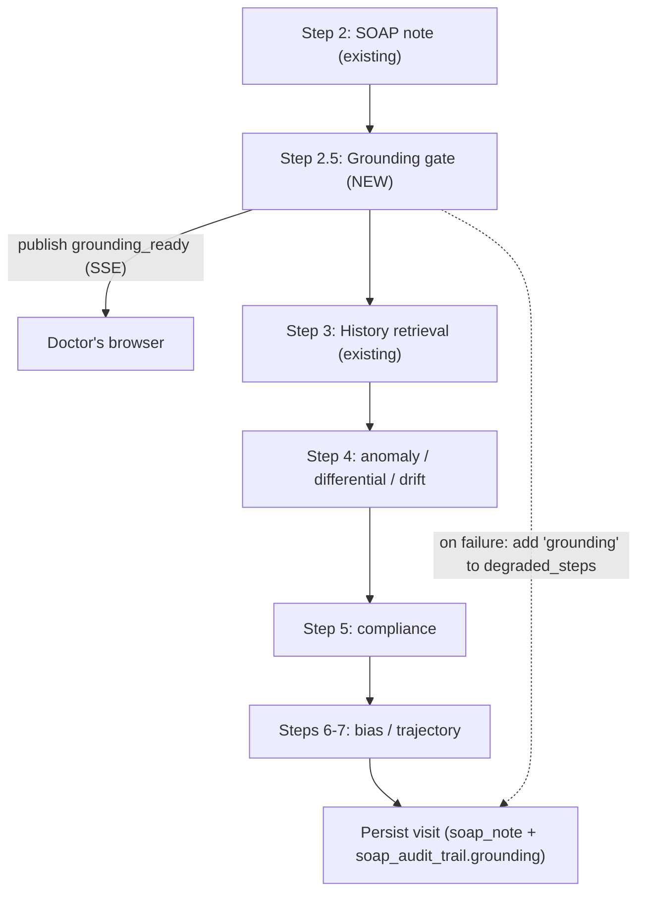
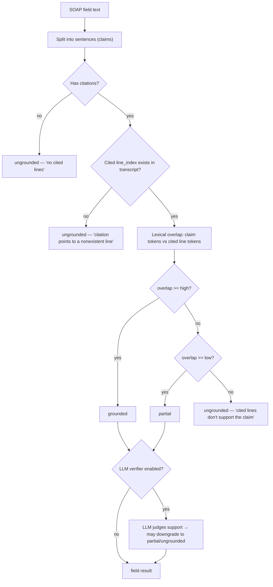

# Grounding Gate — Technical Spec

*The first "trust" feature from `BUILD_PLAN.md`. This spec defines exactly what we'll build, how it slots into the existing pipeline, the data shapes, config, UX, rollout, and tests — in plain English with jargon explained.*

Last updated: 2026-06-12 · Companion to `BUILD_PLAN.md` and `SUCCESS_STATES.md`.

---

## 1. One paragraph (plain English)

When the AI writes a SOAP note, it can occasionally state things the doctor and patient never actually said — a "hallucination." The **grounding gate** is an automatic fact-check: for every sentence in the note, it verifies that the claim is actually backed by a line in the conversation transcript. Sentences that check out are marked **verified**; sentences that don't are **flagged** for the doctor with a confidence score and the reason. We already capture *which* transcript lines each section claims to come from (`source_lines`) — the gate is the piece that **verifies those citations are real and actually support the text**, then surfaces the result so nobody signs a note built on invented facts.

---

## 2. Jargon decoder

| Term | Plain meaning |
|---|---|
| **Grounding** | Checking that every statement in the note traces back to something in the transcript. |
| **Hallucination** | The AI stating a "fact" that isn't supported by the input. |
| **Faithfulness vs. correctness** | Grounding only checks *faithfulness* (did the note stay true to the conversation?). It does **not** check clinical *correctness* — that's the job of the differential / compliance / anomaly agents. A claim can be faithfully transcribed and still be the wrong diagnosis. |
| **Claim** | One checkable statement — we split each SOAP field's text into sentences and treat each as a claim. |
| **Citation / `source_lines`** | The transcript line numbers a SOAP section says it came from. Already produced by `soap_generator`. |
| **Confidence** | A 0–1 score for how well a claim is supported. |
| **The "gate"** | The policy layer: depending on a config mode it can just *warn* about ungrounded claims or *block* signing on them. |
| **Rules-based check** | A fast, deterministic check (no AI) — does the citation exist, and do the cited lines share enough wording with the claim? |
| **LLM verifier** | An optional second-pass AI call that reads the claim + cited lines and judges support semantically. More accurate, costs a request. |
| **`_maybe_call`** | The existing pipeline helper that runs a step and degrades gracefully if it fails (see `BUILD_PLAN.md`). |
| **`degraded_steps`** | The list we already surface in the UI when a pipeline step fails. Grounding will participate in this. |

---

## 3. What exists today vs. the gap

**Already in place** (verified in code):
- `SOAPField` carries `text` **and** `source_lines: list[int]` (`backend/schemas/pipeline.py`).
- `soap_generator` *instructs* the LLM to emit `source_lines` per section (`backend/services/soap_generator.py`), but **nothing checks them**.
- `TranscriptLine` has a stable integer `line_index` that `source_lines` reference.
- An **unused** `visit.soap_audit_trail` JSONB column already exists (`backend/models/visit.py`) — a natural home for grounding results, **no migration needed**.
- `_run_pipeline` orchestration + `_maybe_call` + `degraded_steps` + SSE event bus are all in place.
- `chat_completion` (`backend/services/groq_retry.py`) is ready if/when we enable the LLM verifier.

**The gap:** the citations are taken on faith. There is no verification, no confidence, and nothing shown to the doctor about whether the note is faithful to the conversation.

---

## 4. Goals & non-goals

**Goals**
1. For each SOAP field, verify its sentences are supported by its cited transcript lines.
2. Produce a per-field and overall **confidence** + a list of **unsupported claims** with reasons.
3. Surface it live (SSE) and persist it (`soap_audit_trail`), highlighted in the UI.
4. Degrade gracefully (never crash the pipeline) and be **config-driven** (`off` / `warn` / `enforce`).
5. Ship a **deterministic, no-extra-dependency v1** first; make the LLM verifier an opt-in flag.

**Non-goals (explicitly)**
- Not judging clinical correctness or safety (other agents do that).
- Not auto-deleting doctor-visible text in `warn` mode (preserve clinician authorship).
- Not a replacement for sign-off — it informs the doctor, it doesn't diagnose.

---

## 5. Where it slots into the pipeline

A new **Step 2.5** runs immediately after SOAP generation, before the intelligence agents. It needs only the transcript (already in the request) and the freshly generated SOAP note.



It is invoked through the existing graceful wrapper, so a failure just marks the step degraded (the "Partial note" banner we just built will list it):

```python
# inside _run_pipeline, right after soap_note is ready
grounding_fn = _resolve("services.grounding", "verify")
grounding_result = await _maybe_call(
    grounding_fn,
    soap_note,
    payload.transcript,
    default=None,          # None = "couldn't verify", never a false "grounded"
    label="grounding",
    degraded=degraded_steps,
)
await bus.publish(visit_id_str, EVENT_GROUNDING_READY, {"grounding": _serialise(grounding_result)})
```

---

## 6. How the check works (two layers)



### Layer 1 — Rules (deterministic, ships first, no LLM, instant)
For each non-empty field:
1. **Citation presence:** non-empty text with empty `source_lines` → `ungrounded` (confidence 0).
2. **Citation validity:** every cited number must be a real `line_index` in the transcript. Invalid citations drop `cited_lines_valid=False` and reduce confidence.
3. **Lexical overlap:** tokenize the claim (lowercase, strip a small stopword list) and the union of cited line texts; `overlap = |claim_tokens ∩ cited_tokens| / |claim_tokens|`. Map to status with tunable thresholds (defaults: `>=0.6` grounded, `0.3–0.6` partial, `<0.3` ungrounded). This catches the LLM citing lines that don't actually contain the claimed content.
4. **Field status** = worst meaningful status across its sentences; **field confidence** = mean sentence confidence.

### Layer 2 — LLM verifier (opt-in via flag, more accurate, costs a call)
When `GROUNDING_USE_LLM=true`, fields that are non-trivial (or just Assessment + Plan, the highest-risk) get a second pass: send the claim sentences + their cited transcript lines to `chat_completion` with a strict JSON schema asking for `SUPPORTED | PARTIAL | NOT_SUPPORTED` + a one-line reason per claim. The LLM result can only **downgrade** a rules "grounded" (it never rubber-stamps). Off by default so v1 has zero added latency/cost.

> **Why rules-first:** it's deterministic, free, instant, and good enough to catch the obvious failure modes (missing or fake citations, citations that don't match). The LLM verifier is a precision upgrade we can turn on per-environment once v1 is proven.

---

## 7. Data shapes (new Pydantic, `backend/schemas/pipeline.py`)

```python
GroundingStatus = Literal["grounded", "partial", "ungrounded"]

class GroundingClaim(BaseModel):
    field: SOAPFieldName            # subjective | objective | assessment | plan
    text: str                      # the specific sentence flagged
    status: GroundingStatus
    confidence: float = Field(ge=0.0, le=1.0)
    cited_lines: list[int] = Field(default_factory=list)
    issue: str | None = None       # human-readable reason

class GroundingFieldResult(BaseModel):
    field: SOAPFieldName
    status: GroundingStatus
    confidence: float = Field(ge=0.0, le=1.0)
    cited_lines_valid: bool = True
    unsupported_claims: list[GroundingClaim] = Field(default_factory=list)

class GroundingResult(BaseModel):
    status: GroundingStatus         # overall (worst-weighted across fields)
    confidence: float = Field(ge=0.0, le=1.0)
    fields: list[GroundingFieldResult] = Field(default_factory=list)
    checked_with: Literal["rules", "rules+llm"] = "rules"
```

Add to the existing `PipelinePayload`:

```python
    grounding: GroundingResult | None = None
```

---

## 8. Config & gate modes (`backend/core/config.py`)

| Setting | Default | Meaning |
|---|---|---|
| `GROUNDING_MODE` | `warn` | `off` = skip entirely · `warn` = compute + surface, never block · `enforce` = block sign-off until ungrounded claims are acknowledged |
| `GROUNDING_USE_LLM` | `false` | Enable the Layer-2 LLM verifier |
| `GROUNDING_LLM_FIELDS` | `assessment,plan` | Which fields get the LLM pass when enabled (cost control) |
| `GROUNDING_GROUNDED_THRESHOLD` | `0.6` | Overlap ≥ this = grounded |
| `GROUNDING_PARTIAL_THRESHOLD` | `0.3` | Overlap ≥ this = partial, else ungrounded |
| `GROUNDING_MODEL` | `llama-3.3-70b-versatile` | Reuse the SOAP model for the verifier |

**Recommended rollout:** start in `warn` (informative, non-blocking). Move Assessment/Plan to `enforce` only after we've watched real confidence distributions.

---

## 9. Persistence & transport

- **Persist:** write into the existing column — `visit.soap_audit_trail = {"grounding": grounding_result.model_dump(mode="json")}`. No DB migration.
- **SSE:** new event `EVENT_GROUNDING_READY = "grounding_ready"` in `backend/core/constants.py`; add `"grounding_ready"` to the frontend `SSE_EVENTS` list (`frontend/src/lib/sse.js`).
- **Read-back:** include `grounding` in the `/pipeline/run` response and in `/pipeline/run-status/{visit_id}` (read from `soap_audit_trail`).

---

## 10. Frontend UX (`SessionPage` + `SOAPNote`)

- **Note-level badge:** "Grounding: 92% verified" near the SOAP note; tone shifts green/amber/red by overall status.
- **Per-field marker:** a small "Verified" / "Review" chip on each SOAP section header.
- **Inline flag:** ungrounded sentences get a subtle underline; hover/tap shows the `issue` and the cited line numbers.
- **Degraded:** if grounding is in `degraded_steps`, the existing "Partial note" banner already names it; the badge reads "not verified."
- **Enforce mode only:** the Sign-off confirm dialog gains a checkbox — "I reviewed the flagged statements" — required before signing.

No new heavy components; this rides on the SOAP note and the toast/banner system we just finished.

---

## 11. New/changed files (implementation surface)

| File | Change |
|---|---|
| `backend/services/grounding.py` | **New.** `verify(soap_note, transcript) -> GroundingResult` (Layer 1 always, Layer 2 behind flag). |
| `backend/schemas/pipeline.py` | Add the grounding schemas + `PipelinePayload.grounding`. |
| `backend/core/constants.py` | Add `EVENT_GROUNDING_READY`. |
| `backend/core/config.py` | Add the `GROUNDING_*` settings. |
| `backend/api/routes/pipeline.py` | Call grounding via `_maybe_call`, publish SSE, persist to `soap_audit_trail`, include in payload + run-status. |
| `backend/.env.example` | Document the new settings. |
| `frontend/src/lib/sse.js` | Add `grounding_ready`. |
| `frontend/src/pages/SessionPage/SessionPage.jsx` | Handle event, hold state, pass to SOAP note. |
| `frontend/src/components/SOAPNote/SOAPNote.jsx` (+ css) | Badge, per-field chip, inline flags. |
| `backend/tests/test_grounding.py` | **New.** Unit + pipeline integration tests. |

---

## 12. Testing plan

**Unit (`test_grounding.py`):**
- Grounded: claim words present in cited lines → `grounded`, high confidence.
- Missing citation: text present, `source_lines=[]` → `ungrounded`, reason "no cited lines."
- Invalid citation: `source_lines=[999]` not in transcript → `cited_lines_valid=False`, downgraded.
- Hallucination: cited lines exist but share little wording with the claim → `ungrounded`.
- Empty field: empty text → neutral (not penalized).
- Overall rollup: one ungrounded field drags overall to `partial`/`ungrounded` per weighting.
- LLM path (mocked via `respx`): rules `grounded` + LLM `NOT_SUPPORTED` → downgraded.

**Integration (extend `test_pipeline_routes.py`):**
- `/pipeline/run` returns a `grounding` block; `grounding_ready` is emitted; result persists to `soap_audit_trail` and reappears in `/run-status`.
- Grounding service raising → pipeline still completes, `grounding` in `degraded_steps`.

---

## 13. Phased delivery & magnitude

| Phase | Scope | Effort |
|---|---|---|
| **A (ship first)** | Rules-only Layer 1, `warn` mode, schemas, SSE, persistence, UI badge + flags, tests | Medium |
| **B** | LLM verifier (Layer 2) behind `GROUNDING_USE_LLM`, scoped to Assessment/Plan | Medium |
| **C** | `enforce` mode + sign-off acknowledgement gate | Small |

Phase A is self-contained, adds **no new dependencies**, doesn't touch the SOAP generation logic, and is safe to ship behind `GROUNDING_MODE=warn`.

---

## 14. Open decisions (need your call)

1. **Default mode** — ship Phase A as `warn` (recommended) or jump to `enforce` for Assessment/Plan?
2. **LLM verifier in v1?** — recommend **no** (ship rules-only first), enable in Phase B. Confirm.
3. **Claim granularity** — sentence-level (recommended) vs whole-field. Sentence-level gives precise highlights.
4. **Overlap thresholds** — start at 0.6 / 0.3 and tune from real data? (Recommended.)
5. **Sign-off blocking** — when we reach `enforce`, block signing entirely, or just require the acknowledgement checkbox? (Checkbox recommended — preserves clinician authority.)

---

## 15. Bottom line

The grounding gate turns the `source_lines` we already collect into an enforceable trust signal: **every claim in the note is checked against the conversation, scored, and surfaced** — with a safe, deterministic v1 that ships without new dependencies and a clear path to an LLM-verified, sign-off-enforcing version. It's the foundation the coding agent and EHR write-back depend on, because you can't safely bill or file a note you haven't verified.
