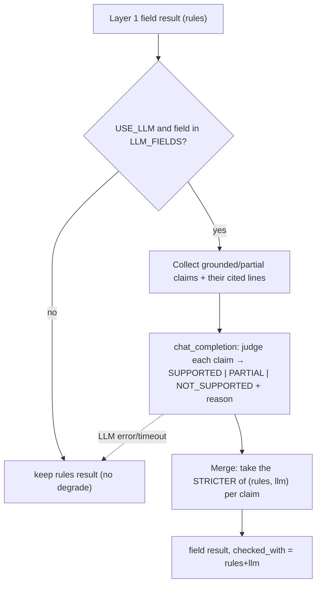
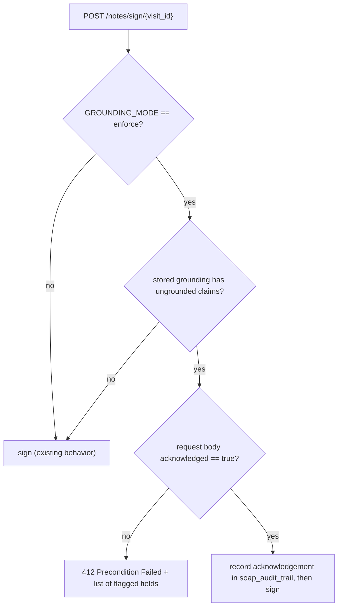

# Grounding Gate — Phases B & C Technical Spec

*Completes the grounding gate started in `GROUNDING_GATE_SPEC.md`. **Phase B** adds an optional LLM verifier (semantic fact-check); **Phase C** adds `enforce` mode with a sign-off acknowledgement gate. Plain English, jargon explained.*

Last updated: 2026-06-12 · Companion to `GROUNDING_GATE_SPEC.md`.

---

## 1. One paragraph (plain English)

Phase A (already shipped) checks each note sentence against the transcript with fast, word-overlap rules and labels it **verified / review / unverified** — but it only *warns*. Two things are left. **Phase B** adds a smarter second opinion: for the riskiest sections (Assessment and Plan), an AI reads the sentence and the exact transcript lines it cites and judges whether they truly support it — catching cases where the words overlap but the *meaning* doesn't. It can only ever make a verdict *stricter*, never rubber-stamp. **Phase C** turns the gate from advice into a guardrail: when switched to `enforce`, the doctor can't sign a note that still has unverified statements without explicitly ticking "I reviewed these" — an auditable acknowledgement.

---

## 2. Jargon decoder

| Term | Plain meaning |
|---|---|
| **Layer 1 (rules)** | The shipped word-overlap check. Fast, deterministic, free. |
| **Layer 2 (LLM verifier)** | An AI second pass that judges *meaning*, not just word overlap. |
| **Downgrade-only** | The LLM can lower a verdict (grounded→partial→ungrounded) but never raise one. Safety property: it can't whitewash a bad citation. |
| **`enforce` mode** | The gate *blocks* sign-off on unverified claims (vs `warn`, which only informs). |
| **Acknowledgement gate** | A required "I reviewed the flagged statements" confirmation before signing in `enforce`. |
| **Sign-off** | The doctor finalizing + locking the note (`POST /notes/sign/{visit_id}`). |
| **`soap_audit_trail`** | The JSONB column already holding `{"grounding": …}`; we'll also stamp the acknowledgement here for the record. |

---

## 3. What exists today (Phase A recap)

- `services/grounding.verify(soap_note, transcript) -> GroundingResult` (rules only, `checked_with="rules"`).
- `GroundingResult` / `GroundingFieldResult` / `GroundingClaim` schemas; `PipelinePayload.grounding`.
- Config already present and unused for B/C: `GROUNDING_USE_LLM` (false), `GROUNDING_LLM_FIELDS` (`assessment,plan`), `GROUNDING_MODEL`, and `GROUNDING_MODE` (`off|warn|enforce`).
- Result persisted to `soap_audit_trail.grounding`, streamed via `grounding_ready`, rendered as badge/chips/flags in `SOAPNote`.
- Grounding runs on **de-identified** text (after the de-id layer), so the Phase-B LLM call carries no raw PHI.

**The gap:** `GROUNDING_USE_LLM` and `enforce` are wired into config but do nothing yet.

---

## Phase B — LLM verifier (Layer 2)

### B.1 Where it fits
Inside `verify()`, after Layer 1 produces field results. When `GROUNDING_USE_LLM=true`, claims in the configured fields (`GROUNDING_LLM_FIELDS`, default Assessment + Plan) that Layer 1 rated **grounded or partial** get a second pass. (Already-`ungrounded` claims are skipped — they're flagged regardless.)

### B.2 The call
- One `chat_completion` per field (batch all that field's eligible claims) → minimizes requests/cost.
- Model: `settings.GROUNDING_MODEL`; `response_format={"type":"json_object"}`; `temperature=0.0`; small `max_tokens`.
- Prompt (system): "You verify faithfulness. For each claim, decide if the cited transcript lines support it. Output ONLY JSON. SUPPORTED = fully stated/entailed; PARTIAL = related but not fully supported; NOT_SUPPORTED = not derivable. Judge faithfulness to the lines, not clinical correctness."
- User payload: the claim sentences + the **text of their cited lines** (we already have `line_index`→text), as JSON.
- Parse → map `SUPPORTED→grounded`, `PARTIAL→partial`, `NOT_SUPPORTED→ungrounded`.

### B.3 Merge rule (downgrade-only)
`final = min(rules_status, llm_status)` by severity rank (`ungrounded < partial < grounded`). The LLM can only tighten. Confidence becomes `min(rules_conf, llm_conf_proxy)` where the proxy is `{grounded:0.9, partial:0.5, ungrounded:0.1}`. Newly downgraded claims get the LLM's one-line reason and are added to `unsupported_claims`. `checked_with` flips to `"rules+llm"` for the result.

### B.4 Resilience & cost
- Wrapped in try/except **inside** `verify`: an LLM failure logs and **keeps the Layer-1 result** (no pipeline degrade, `checked_with` stays `"rules"`). The gate must never become a single point of failure.
- Off by default. Scoped to 2 fields. ~1–2 extra Groq calls per run only when enabled.

### B.5 Files (Phase B)
| File | Change |
|---|---|
| `backend/services/grounding.py` | Add `_llm_verify_field(...)` using `chat_completion`; call it from `verify` behind the flag; set `checked_with`. Make the helpers tolerant of de-identified placeholders (no change needed — treated as plain tokens). |
| `backend/services/grounding.py` (config use) | Read `GROUNDING_USE_LLM`, `GROUNDING_LLM_FIELDS`, `GROUNDING_MODEL`. |
| `backend/tests/test_grounding.py` | Add LLM-path tests (mock `chat_completion`). |

### B.6 Tests (Phase B)
- Rules `grounded` + LLM `NOT_SUPPORTED` → final `ungrounded`, `checked_with="rules+llm"`, reason from LLM.
- Rules `partial` + LLM `SUPPORTED` → stays `partial` (downgrade-only; never upgraded).
- LLM raises/times out → Layer-1 result preserved, `checked_with="rules"`, pipeline still completes.
- Only `GROUNDING_LLM_FIELDS` get the call (assert no call for subjective/objective).

---

## Phase C — `enforce` mode + sign-off acknowledgement gate

### C.1 Behavior
In `GROUNDING_MODE=enforce`, signing a note that still has ungrounded claims requires an explicit acknowledgement. `warn`/`off` are unchanged.

### C.2 Backend
- New optional request body for sign: `NoteSignRequest { acknowledged: bool = False }` (sign currently takes no body; add an optional body so existing callers in `warn`/`off` keep working).
- In `sign_note`: if `settings.GROUNDING_MODE == "enforce"`, read `visit.soap_audit_trail["grounding"]`. If overall `status == "ungrounded"` or any field has `unsupported_claims` and `not acknowledged` → raise `412` with `detail` naming the flagged fields.
- On acknowledged sign, stamp `soap_audit_trail["grounding_ack"] = {"by": user.id, "at": <utc>}` for audit, then proceed.
- Edge: missing grounding (e.g., it was degraded) in `enforce` → **fail-closed** (treat as needs-acknowledgement) so a missing check can't be a silent bypass. (Open decision #2.)

### C.3 Frontend (`SessionPage` + `ConfirmDialog`)
- The sign `ConfirmDialog` gains an **acknowledgement checkbox**, shown only when `grounding` has ungrounded claims: "I reviewed the flagged statements and accept responsibility." Confirm button disabled until checked.
- `handleConfirmSignOff` sends `{ acknowledged: true }` in the sign request when the box is shown.
- On `412`, surface a toast + keep the dialog open with the flagged fields highlighted (the `SOAPNote` already renders per-field flags).

### C.4 Files (Phase C)
| File | Change |
|---|---|
| `backend/schemas/visit.py` | Add `NoteSignRequest { acknowledged: bool = False }`. |
| `backend/api/routes/notes.py` | Enforce gate in `sign_note`; stamp `grounding_ack`. |
| `frontend/src/components/ConfirmDialog/ConfirmDialog.jsx` | Optional acknowledgement checkbox (controlled prop). |
| `frontend/src/pages/SessionPage/SessionPage.jsx` | Compute "has ungrounded", show checkbox, send `acknowledged`, handle 412. |
| `backend/tests/test_notes_routes.py` | Enforce-mode tests. |

### C.5 Tests (Phase C)
- `enforce` + ungrounded grounding + no ack → `412`; the visit stays unsigned.
- `enforce` + ungrounded + `acknowledged=true` → `200`, `is_signed=true`, `grounding_ack` stamped.
- `enforce` + all grounded → signs with no ack needed.
- `warn`/`off` → signs regardless (no regression to existing behavior).
- `enforce` + grounding missing/degraded → `412` (fail-closed).

---

## 4. Combined rollout

| Phase | Scope | Effort | Risk |
|---|---|---|---|
| **B** | LLM verifier behind `GROUNDING_USE_LLM`, Assessment/Plan only, downgrade-only, resilient | Medium | Low (off by default) |
| **C** | `enforce` sign-off gate + acknowledgement, fail-closed | Small–Med | Medium (changes sign flow; gated by `GROUNDING_MODE`) |

Recommended order: **B then C** — prove the verifier improves precision in `warn` first, then turn on `enforce` once we trust the verdicts. Both are independent and behind existing flags, so either can ship alone.

---

## 5. Open decisions (need your call)

1. **Verifier scope** — Assessment + Plan only (recommended, cost) vs all four fields?
2. **Missing-grounding behavior in `enforce`** — fail-closed/require ack (recommended, safer) vs fail-open/allow sign?
3. **Acknowledgement granularity** — one checkbox for the whole note (recommended) vs per-flagged-claim acknowledgement?
4. **Block status code** — `412 Precondition Failed` (recommended, semantically precise) vs `409 Conflict`?
5. **Ship B and C together or separately?** — recommend B first (in `warn`), then C.

---

## 6. Bottom line

Phase B upgrades the grounding gate from "do the words overlap?" to "does the cited evidence actually mean this?" — safely, behind a flag, downgrade-only, and resilient. Phase C turns the verified signal into a real guardrail: no unverified claim reaches a *signed* note without an auditable acknowledgement. Together they complete the trust story — verification you can both *measure* (with the eval harness) and *enforce*.
